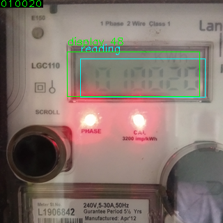

## Extraction of readings from electricity meeter
Extraction of electricity meeter reading using machine learning using
- Object detection (Mobilenst SSD)
- Text detection (EAST)
- Text recognition (CRNN)

>Input images shape needs to have same height and width

### Install

#### Using Docker (recommended)
Install docker, https://docs.docker.com/engine/install/

```console
docker run -p 8501:8501 renjithks/meeter-reader-inference
```
Then go to, http://localhost:8501

>To get older versions, go to [docker hub](https://hub.docker.com/repository/docker/renjithks/meeter-reader-inference "") 

#### Using pip

Tested with `python` version `3.8`, although, any version higher than `3.7` should also work.

To install the dependencies
```console
pip install -r requirements.txt
```

Install lanms.
- Linux
  ```console
  cd lanms
  cp Makefile.nix Makefile
  make
  ```
- Mac
  ```console
  cd lanms
  cp Makefile.mac Makefile
  make
  ```
- Windows
  ```console
    cd lanms
    cp Makefile.win Makefile
    make
  ```
  [How to compile lanms on Windows?](https://github.com/argman/EAST/issues/120)
### Evaluation

##### Web
  ```
  streamlit run app.py
  ```
You can now view the in your browser, http://localhost:8501
##### CLI
```console
❯ python run.py -h
usage: run.py [-h] [--image IMAGE] [--input_folder INPUT_FOLDER] [--output_folder OUTPUT_FOLDER]

optional arguments:
  -h, --help            show this help message and exit
  --image IMAGE         Path to image
  --input_folder INPUT_FOLDER
                        Path to input folder
  --output_folder OUTPUT_FOLDER
                        Path to output folder
```

To run the inferece on a single image.
```console
python run.py --image tests/2.png
```
To run inference on images in a directory.
```console
python run.py --input_folder tests
```
Predictions are saved to `output` folder by default.

### Resutls
 
 
