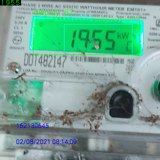

### Extraction of readings from electricity meeter

#### Install
Tested with `python` version `3.8`, although, any version higher than `3.7` should also work.

To install the dependencies
```console
pip install -r requirements.txt
```

Install lanms.
- Linux
  ```console
  cd lanms
  cp Makefile.nix Makefile
  make
  ```
- Mac
  ```console
  cd lanms
  cp Makefile.mac Makefile
  make
  ```
- Windows
  ```console
    cd lanms
    cp Makefile.win Makefile
    make
  ```
  [How to compile lanms on Windows?](https://github.com/argman/EAST/issues/120)
#### Evaluation
To run the inferece on a single image.
```console
python run.py --image tests/2.png
```
 
 

To run inference on images in a directory.
```console
python run.py --input_folder tests
```
Predictions are saved to `output` folder by default.